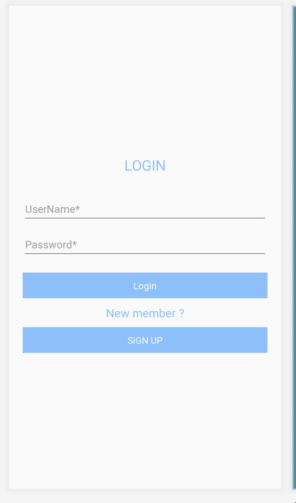
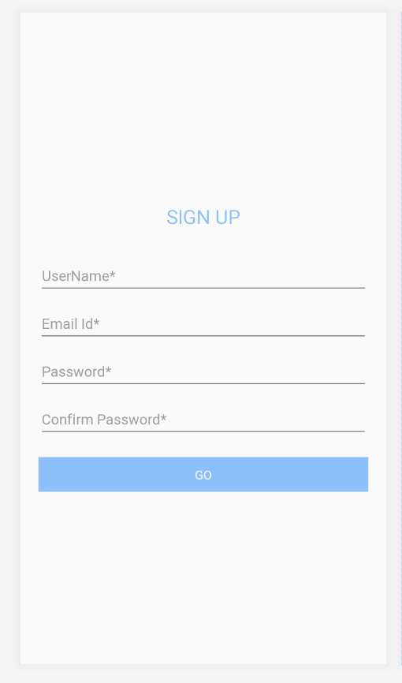
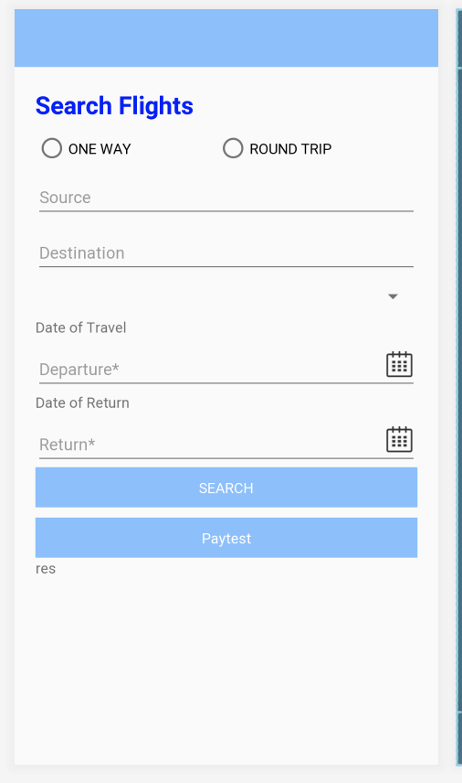

# Study-SkySearch
Flight system

# Class Diagram Implementations
- Abhishek : Created a branch name "Abhishek" and all his code related to Third party imlplemetation and System models are present in that branch. Some of the code is there in master because initially we merged the code.

- Prashant : Created a barnch name "Prashant" and all Models related to Flight data , Email confirmatio and payment are there, some of the code is there in master because initially we merged the code.

- Farina : Created a branch name "Farina" and created User model object basic UI realted changes, added comments to the code already in master as before I worked direclty on master.

Some code needs to be merged to find implementation in other branch, it will give error while compiling individual branches.

## Splash Screen
This is the first screen that appears when user opens the SkySearch app

## Login

## Sign up

## flight Search Screen

